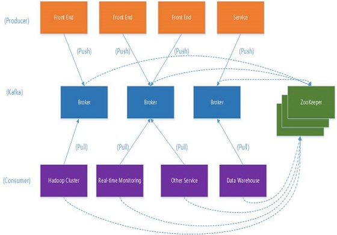

* content
{:toc}

Kafka作为时下最流行的开源消息系统，被广泛地应用在数据缓冲、异步通信、汇集日志、系统解耦等方面。相比较于RocketMQ等其他常见消息系统，Kafka在保障了大部分功能特性的同时，还提供了超一流的读写性能。

## Kafka 基本框架名词

1.    Topic：用于划分Message的逻辑概念，一个Topic可以分布在多个Broker上。
  
1.    Partition：是Kafka中横向扩展和一切并行化的基础，每个Topic都至少被切分为1个Partition。

3.    Offset：消息在Partition中的编号，编号顺序不跨Partition。

4.    Consumer：用于从Broker中取出/消费Message。

5.    Producer：用于往Broker中发送/生产Message。

6.    Replication：Kafka支持以Partition为单位对Message进行冗余备份，每个Partition都可以配置至少1个Replication(当仅1个Replication时即仅该Partition本身)。

7.    Leader：每个Replication集合中的Partition都会选出一个唯一的Leader，所有的读写请求都由Leader处理。其他Replicas从Leader处把数据更新同步到本地，过程类似大家熟悉的MySQL中的Binlog同步。

8.    Broker：Kafka中使用Broker来接受Producer和Consumer的请求，并把Message持久化到本地磁盘。每个Cluster当中会选举出一个Broker来担任Controller，负责处理Partition的Leader选举，协调Partition迁移等工作。

9.    ISR(In-Sync Replica)：是Replicas的一个子集，表示目前Alive且与Leader能够“Catch-up”的Replicas集合。由于读写都是首先落到Leader上，所以一般来说通过同步机制从Leader上拉取数据的Replica都会和Leader有一些延迟(包括了延迟时间和延迟条数两个维度)，任意一个超过阈值都会把该Replica踢出ISR。每个Partition都有它自己独立的ISR。

以上几乎是我们在使用Kafka的过程中可能遇到的所有名词，同时也无一不是最核心的概念或组件，感觉到从设计本身来说，Kafka还是足够简洁的。这次本文围绕Kafka优异的吞吐性能，逐个介绍一下其设计与实现当中所使用的各项“黑科技”。

## Broker

  不同于Redis和MemcacheQ等内存消息队列，Kafka的设计是把所有的Message都要写入速度低容量大的硬盘，以此来换取更强的存储能力。实际上，Kafka使用硬盘并没有带来过多的性能损失，“规规矩矩”的抄了一条“近道”。

  首先，说“规规矩矩”是因为Kafka在磁盘上只做Sequence I/O，由于消息系统读写的特殊性，这并不存在什么问题。关于磁盘I/O的性能，引用一组Kafka官方给出的测试数据(Raid-5，7200rpm)：

  Sequence I/O: 600MB/s

  Random I/O: 100KB/s

  所以通过只做Sequence I/O的限制，规避了磁盘访问速度低下对性能可能造成的影响。

  接下来我们再聊一聊Kafka是如何“抄近道的”。

  首先，Kafka重度依赖底层操作系统提供的PageCache功能。当上层有写操作时，操作系统只是将数据写入PageCache，同时标记Page属性为Dirty。当读操作发生时，先从PageCache中查找，如果发生缺页才进行磁盘调度，最终返回需要的数据。实际上PageCache是把尽可能多的空闲内存都当做了磁盘缓存来使用。同时如果有其他进程申请内存，回收PageCache的代价又很小，所以现代的OS都支持PageCache。

  使用PageCache功能同时可以避免在JVM内部缓存数据，JVM为我们提供了强大的GC能力，同时也引入了一些问题不适用与Kafka的设计。

  如果在Heap内管理缓存，JVM的GC线程会频繁扫描Heap空间，带来不必要的开销。如果Heap过大，执行一次Full GC对系统的可用性来说将是极大的挑战。

  所有在在JVM内的对象都不免带有一个Object Overhead(千万不可小视)，内存的有效空间利用率会因此降低。

  所有的In-Process Cache在OS中都有一份同样的PageCache。所以通过将缓存只放在PageCache，可以至少让可用缓存空间翻倍。

  如果Kafka重启，所有的In-Process Cache都会失效，而OS管理的PageCache依然可以继续使用。

  PageCache还只是第一步，Kafka为了进一步的优化性能还采用了Sendfile技术。在解释Sendfile之前，首先介绍一下传统的网络I/O操作流程，大体上分为以下4步。

    1.    OS 从硬盘把数据读到内核区的PageCache。
    
    2.    用户进程把数据从内核区Copy到用户区。
    
    3.    然后用户进程再把数据写入到Socket，数据流入内核区的Socket Buffer上。
    
    4.    OS 再把数据从Buffer中Copy到网卡的Buffer上，这样完成一次发送。

