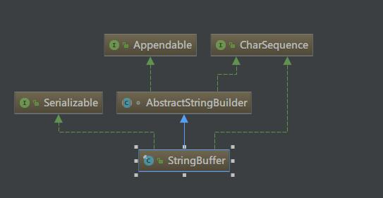
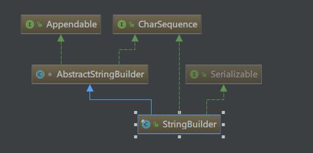

* content
{:toc}

Git，TortoiseGit及Git在IDE工具中的使用

## Git基础介绍

> 要认识Git是做什么的，为什么要使用这个工具，就需要先阅读一下Git相关的入门知识，及与其他版本控制工具的异同，优劣。本文重点在其日常使用上，所以我贴两篇资料，可以先补充一下这方面知识。

> Git起步：<http://blog.jobbole.com/25775/> , <https://git-scm.com/book/zh/v2>

> Git教程：<https://www.liaoxuefeng.com/wiki/0013739516305929606dd18361248578c67b8067c8c017b000>

## Git 与 TortoiseGit 安装

