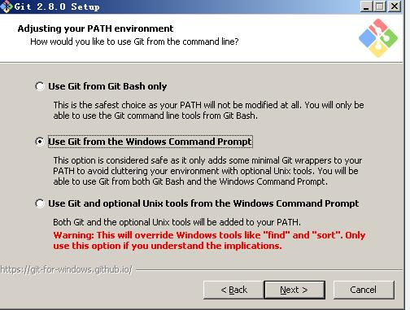
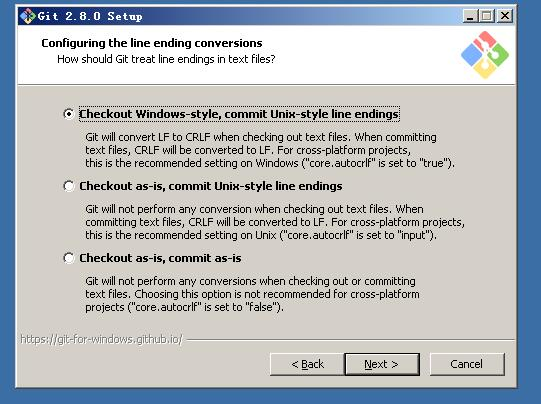
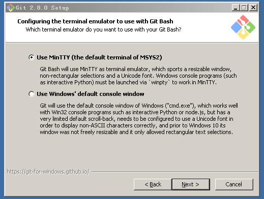
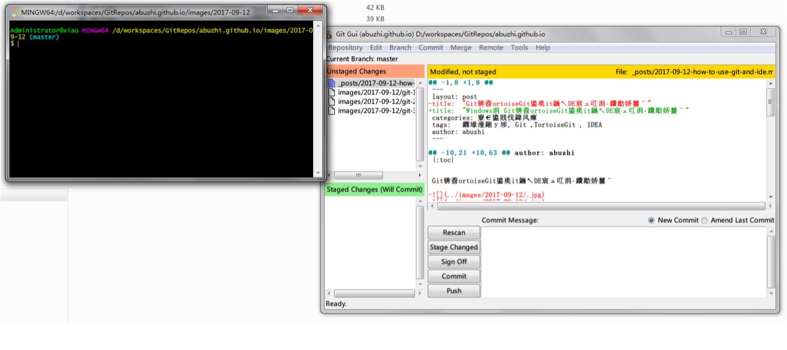

* content
{:toc}

Git，TortoiseGit及Git在IDE工具中的使用

--------------------

## 1. Git基础介绍

> 要认识Git是做什么的，为什么要使用这个工具，就需要先阅读一下Git相关的入门知识，及与其他版本控制工具的异同，优劣。注意：本文重点偏重于Git,TortoiseGit以及Git在IDEA等开发工具日常安装与使用上。

> 对于Git的认识及入门知识，笔者先贴两篇资料，可以先补充一下这方面知识，或者做全面学习资料亦可：

> Git起步：<http://blog.jobbole.com/25775/> , <https://git-scm.com/book/zh/v2>

> Git教程：<https://www.liaoxuefeng.com/wiki/0013739516305929606dd18361248578c67b8067c8c017b000>

## 2. Git 与 TortoiseGit 安装

> Git 下载地址：<https://git-scm.com/downloads>

> TortoiseGit 下载地址：<https://tortoisegit.org/download> 

按自己的操作系统选择下载相应版本。

#### 1. 安装Git

先安装Git.xxx.exe，安装路径自己设置或者默认，其他选项都按默认来就行。其中需要说明中间几个选项的意思：

 图-2.1

* 选项1 ：此选项不会先环境变量中加入git命令目录，只能使用Git Bash命令行操作。不建议新手安装此项。

* 选项2 ：默认选项，只会加入最小量的信息到环境变量中，可以使用Git Bash 和windows 命令行进行操作。建议安装此项。

* 选项3 ：此项会把unix tools 相关命令和Git Bash命令都加入到windows环境变量中，会污染系统，比如会覆盖掉windows自带的find等命令，不建议安装此项。

------

 图-2.2

CRLF是Carriage-Return Line-Feed的缩写，意思是回车换行，就是回车(CR, ASCII 13, \r) 换行(LF, ASCII 10, \n)

windows系统默认换行是两个字符\r\n，即CRLF；；unix和linux系统的换行符只有一个字符\n，即LF。

此安装选项就是设置windows和unix类系统下，换行符的转换。

* 选项1 ：git check out代码下来到windows系统时，转换LF为CRLF，即转为windows换行符。当commit 操作时，转换CRLF为LF，即转为unix换行符。此选项比较推荐用于跨平台的代码情况下，在windows机器上安装git时，比如git 远程仓库的所在系统为linux系统，本地开发环境为windows时。用此项。

* 选项2 ：check out时，不进行转换，只有commit时，才转换CRLF 为LF，此项用于跨平台时，linux和unix环境机器上安装git时，选用些项。

* 选项3 ：check out 和  commit时都不进行转换，这种只能用于相同平台下的开发。不建议用在跨平台的代码系统中。

------

 图-2.3 

 图-2.4

* 选项1 ：Git Bash命令在MinTTY中进行操作，也可以在windows命令行操作。（图-2.4即为安装好后，MinTTY，分为shell和gui两种界面。如果安装了TortoiseGit，这个基本就不需要用了，但是还是建议安装这个选项）

* 选项2 ：只使用windows命令行操作。

------

其他安装都用默认即可。

#### 2. 安装TortoiseGit

安装TortoiseGit比较简单，只需要按默认安装即可。安装路径可自己修改。

------

## 3. Git 与 TortoiseGit 的使用

